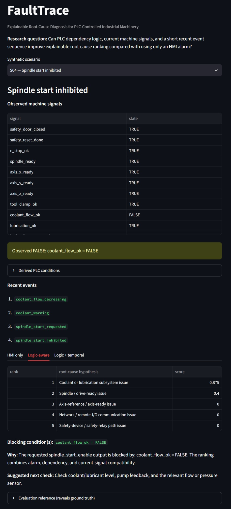
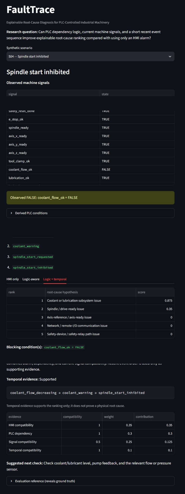
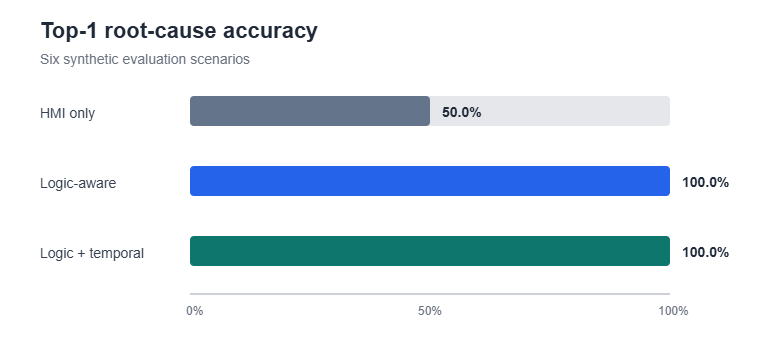

# FaultTrace

## Explainable Root-Cause Diagnosis for PLC-Controlled Industrial Machinery

FaultTrace is a compact research prototype that explores whether PLC dependency logic, current machine signals, and limited recent-event evidence can improve explainable root-cause ranking beyond an operator-facing HMI alarm.

**Research prototype · Synthetic machine · No real PLC connection · Human verification required**



*Logic-aware diagnosis for the synthetic S04 spindle-start inhibition scenario.*

---

## The Problem

Industrial HMIs are effective at showing alarms and blocked machine conditions, but an immediate message does not always reveal the deeper subsystem or component-level cause.

FaultTrace explores the next diagnostic step:

**HMI symptom → blocked PLC condition → plausible root-cause hypotheses → next diagnostic check**

The goal is not to replace the PLC or the operator. It is to make the reasoning behind a fault hypothesis more transparent.

---

## Research Question

> Can PLC dependency logic, current machine signals, and a short recent event sequence improve explainable root-cause ranking compared with using only an HMI alarm?

---

## What I Built

FaultTrace uses one fictional CNC-style machine with common machine-tool subsystems such as:

- safety and emergency-stop conditions
- spindle / drive readiness
- X/Y/Z axis readiness
- tool clamping
- coolant and lubrication
- hydraulic pressure
- remote I/O / network communication

The project compares three diagnostic configurations:

| Mode | Evidence used | Purpose |
|---|---|---|
| **HMI only** | HMI alarm/message | Baseline |
| **Logic-aware** | HMI + current signals + PLC dependencies | Trace the blocking condition and rank likely causes |
| **Logic + temporal** | Logic-aware evidence + recent event order | Add limited temporal support |

The scoring is deterministic and intentionally transparent rather than learned.

---

## How It Works

```text
HMI symptom
   +
PLC dependency rules
   +
current machine signals
   +
optional recent events
        ↓
evidence scoring
        ↓
ranked root-cause hypotheses
        ↓
blocking condition + explanation
        ↓
suggested next diagnostic check
```

The important step is the transition from the operator-facing symptom to the PLC condition that prevents the requested machine function.

---

## Example: Spindle Start Inhibited

In scenario **S04**, the spindle-start request is inhibited while most relevant machine conditions remain healthy.

The key observation is:

`coolant_flow_ok = FALSE`

The Logic-aware mode traces this through the PLC-style dependency rules and ranks the **coolant/lubrication subsystem** as the strongest diagnostic direction.

It then suggests checking the relevant coolant or lubrication path, such as level, pump feedback, or flow/pressure sensing.

This remains a diagnostic hypothesis rather than proof of a physical root cause.



*Logic + temporal mode adds recent event-sequence evidence while preserving the same ranked diagnostic direction.*

---

## What Temporal Evidence Adds

The temporal configuration also considers a short progression such as:

```text
coolant_flow_decreasing
→ coolant_warning
→ spindle_start_inhibited
```

In this experiment, the event order supports the coolant-related diagnosis. It does **not** prove that a physical component has failed.

More importantly, temporal evidence did not improve classification accuracy because the simple PLC dependency logic already resolved the six controlled scenarios.

That is a useful result: additional evidence is not automatically valuable when the existing logic is already sufficient.

---

## Evaluation

FaultTrace was evaluated on **six hand-authored synthetic scenarios**.

| Configuration | Top-1 accuracy | Top-3 accuracy |
|---|---:|---:|
| HMI only | 50.0% | 83.3% |
| Logic-aware | 100.0% | 100.0% |
| Logic + temporal | 100.0% | 100.0% |



*Top-1 root-cause accuracy across six synthetic evaluation scenarios.*

The results suggest that explicit PLC dependency information can be substantially more informative than the HMI alarm alone in these controlled cases.

The 100% values apply **only to the six synthetic evaluation scenarios** and do not establish industrial validity or generalization.

---

## Key Design Choices

**Transparent reasoning**  
Scores come from fixed evidence components such as alarm compatibility, PLC dependency match, signal compatibility, and optional temporal compatibility.

**No black-box diagnostic model**  
The prototype deliberately uses deterministic scoring so the diagnosis can be inspected and explained.

**Logical cause is not physical root cause**  
Identifying a failed PLC condition narrows the diagnostic path, but does not automatically identify the actual failed component.

**Human verification**  
FaultTrace is advisory only. The suggested root cause and diagnostic check require human confirmation.

---

## What I Learned

Three observations stood out:

1. **PLC logic contains useful diagnostic structure.** Dependency rules can narrow a broad HMI symptom to the condition preventing an operation.
2. **More context does not automatically mean better accuracy.** The temporal layer added useful support but did not improve classification in these simple cases.
3. **Fault diagnosis requires separating logical and physical causes.** A false signal or blocked permissive is evidence, not proof of component failure.

---

## Limitations

- six synthetic scenarios
- hand-authored PLC-style rules
- fixed deterministic scoring
- no real PLC or machine connection
- no physical-machine validation
- no uncertainty calibration
- no complex interacting faults

---

## Future Direction

A larger research programme could extend the concept toward:

- real IEC 61131-3 PLC programs
- larger dependency graphs
- richer event histories
- temporal and causal reasoning
- uncertainty-aware diagnosis
- automated diagnostic tests
- operator validation
- industrial evaluation

FaultTrace is intentionally a small preliminary study of the underlying diagnostic problem.

---

## Technology

**Python · Streamlit · PLC-style dependency logic · Deterministic evidence scoring**

---

## Links

- [GitHub repository](https://github.com/mehrabfajar/FaultTrace)
