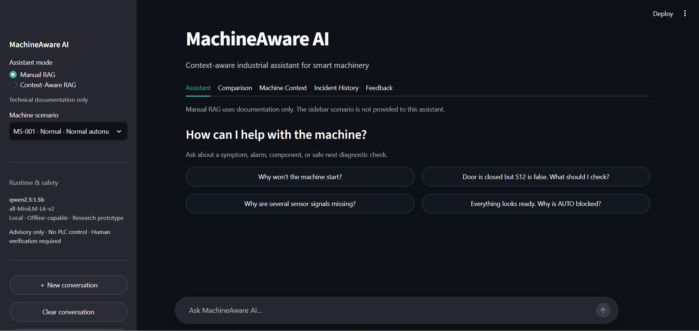
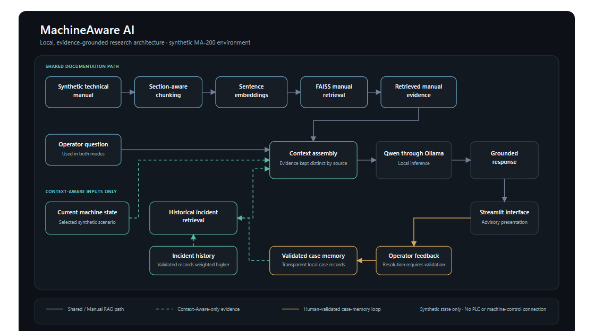
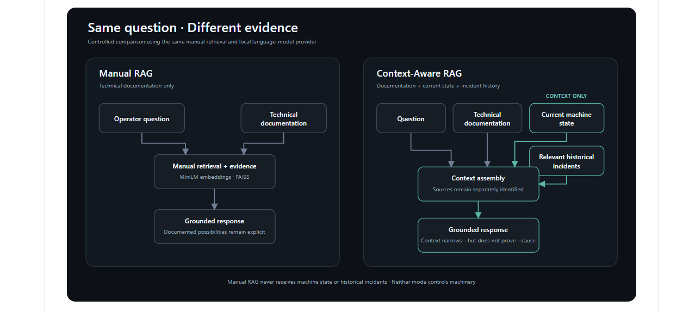
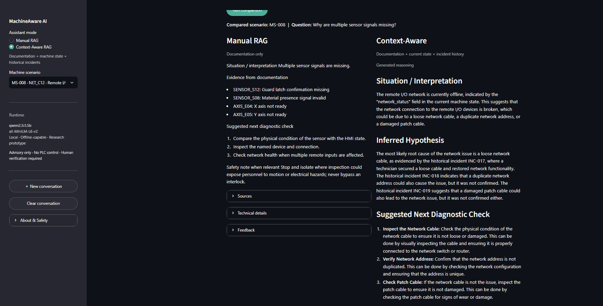
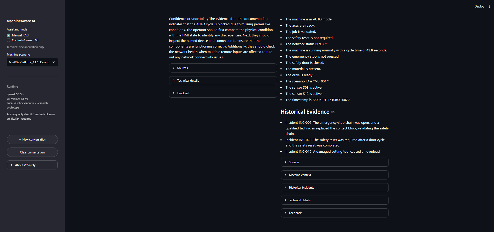
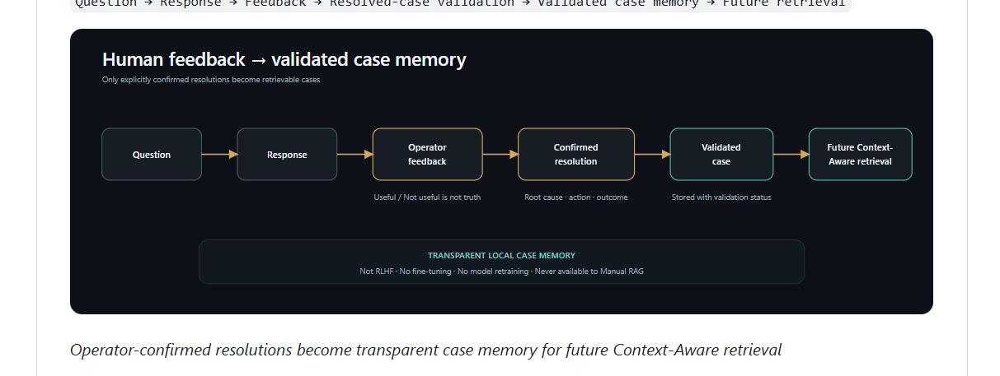

# MachineAware AI

## Context-Aware Industrial Assistant for Smart Machinery

MachineAware AI is a local research prototype exploring whether industrial troubleshooting assistance becomes more useful when technical documentation is combined with **current machine state** and **historical incidents**, instead of relying on documentation alone.

**Focus:** Industrial AI · RAG · LLMs · Decision Support · Human-in-the-Loop  
**Tech:** Python · Sentence Transformers · FAISS · Ollama · Qwen2.5 · Streamlit · SQLite

[View the project on GitHub](https://github.com/mehrabfajar/MachineAware-AI)

*MachineAware AI conversational interface.*

---

## The Problem

Industrial troubleshooting rarely depends on a manual alone. An operator may also need to consider active alarms, sensor states, machine conditions, previous incidents, and practical experience.

A documentation-only RAG assistant can explain what a manual says, but it does not know what is happening on the machine at that moment. MachineAware AI was built to investigate whether adding operational context can make troubleshooting guidance more focused and better grounded.

## Research Question

> Does combining technical documentation with current machine context and historical incidents improve the grounding and usefulness of industrial troubleshooting assistance compared with documentation-only RAG?

---

## What I Built

I developed a local industrial AI prototype with two controlled assistant modes, a synthetic machine environment, historical-case retrieval, a human-validated case-memory workflow, and a paired evaluation framework.

The project includes:

- documentation-grounded RAG with FAISS retrieval;
- current machine-state context;
- transparent historical-incident ranking;
- local Qwen inference through Ollama;
- Manual vs Context-Aware comparison;
- human feedback and validated case memory;
- Streamlit interface and evidence inspection;
- controlled evaluation across 24 paired scenarios.

---

## System Architecture

The system keeps documentation retrieval shared between both modes while adding machine state and incident history only to Context-Aware RAG. The assistant remains advisory: there is no PLC or machine-control connection.

*MachineAware AI architecture: shared documentation retrieval, Context-Aware evidence, local generation, and human-validated case memory.*

---

## Manual RAG vs Context-Aware RAG

Both modes use the same manual retrieval pipeline and local language-model provider. The key difference is the evidence available before generation.

**Manual RAG** uses:

`operator question + retrieved technical documentation`

**Context-Aware RAG** uses:

`operator question + technical documentation + current machine state + relevant historical incidents`

Historical similarity is treated as a diagnostic clue, not proof of the current root cause.

*The same question is processed with different evidence: documentation only versus documentation plus current state and relevant incidents.*

### Real comparison in the application

*The same troubleshooting question answered by both modes side by side.*

---

## Synthetic Industrial Environment

To keep the project reproducible and free of confidential industrial data, I created a fictional machine environment called **MA-200**, an automated machining and inspection cell.

The synthetic environment includes:

- 13 machine-state scenarios;
- 30 historical incidents;
- 24 evaluation scenarios;
- a structured technical manual;
- fictional alarms, sensors, operating modes, drives, axes, and network states.

Identifiers such as `S12`, `MS-002`, and `SAFETY_A17` are synthetic and do not represent a real manufacturer or machine.

---

## Context and Evidence

The core pipeline is:

`Question → Embedding → FAISS retrieval → Evidence assembly → Qwen through Ollama → Grounded response`

Context-Aware mode adds two evidence sources before generation:

1. **Current machine state** — alarms, sensors, network, drive, axis, job, and safety conditions.
2. **Historical incident retrieval** — a small set of relevant previous cases ranked using alarm, state, symptom, semantic, and validation signals.

Only the most relevant incidents are passed to the LLM rather than the full incident database.

*Current machine evidence and retrieved historical incidents remain visible to the user instead of being hidden behind the generated answer.*

---

## Human-in-the-Loop Case Memory

Operators can mark responses as useful or not useful, but feedback alone is never treated as truth. A resolved case must be explicitly validated with a confirmed root cause, action, and outcome before it can become future retrieval evidence.

*Only operator-confirmed resolutions become transparent case memory for future Context-Aware retrieval.*

This is **not RLHF, fine-tuning, or model retraining**. It is a local case-memory mechanism that keeps the language model unchanged.

---

## Evaluation

I evaluated both modes on the same **24 paired synthetic scenarios**, producing 48 generated responses.

### Archived controlled experiment

| Metric | Manual RAG | Context-Aware |
| --- | ---: | ---: |
| Diagnostic score | 0.542 | 0.667 |
| Next-action score | 0.396 | 0.625 |
| Unsupported invented facts | 4/24 | 0/24 |
| Mean latency | 46.7 s | 73.9 s |

The strongest improvement appeared in scenarios involving multiple signals or possible common causes. Context helped the assistant select more targeted next diagnostic actions, but it also increased inference time.

A later **512-token post-refinement evaluation** preserved the Context-Aware diagnostic score at **0.667**, increased the next-action score to **0.667**, and reduced mean latency to **64.4 s**. Automated overconfidence detection flagged 16/24 responses; manual review confirmed **4 true overconfidence cases**, while 8 were reasonable qualified inferences and 4 were detector false positives.

The result reinforced an important design lesson: more context can improve troubleshooting direction, but historical similarity must be handled carefully because it can also encourage overly specific root-cause claims.

---

## Key Takeaways

- Operational context can make RAG responses more targeted than documentation-only retrieval.
- Historical incidents are useful evidence but should never be treated as proof.
- Current observed machine state should take priority over contradictory historical cases.
- Uncertainty handling is as important as retrieval quality.
- Deterministic safeguards remain important around generative reasoning.
- Evaluation should consider usefulness, hallucination risk, latency, uncertainty, and safety—not just retrieval accuracy.

---

## Safety Boundary

MachineAware AI is an **advisory research prototype** only.

- no PLC or real-machine connection;
- no machine-control capability;
- no interlock override or safety bypass;
- no confidential industrial data;
- human verification required.

The synthetic manual and scenarios are research data, not operating instructions for a physical machine.

---

## Limitations & Future Work

The current work uses a synthetic environment and a relatively small evaluation set. Future work could investigate:

- authorized real technical manuals and PDF ingestion;
- read-only PLC or OPC-UA context;
- multimodal machine information;
- improved uncertainty calibration;
- learned incident ranking;
- operator personalization;
- multi-agent architectures;
- validation in real industrial environments.

---

## Technology Stack

**Python · Sentence Transformers · all-MiniLM-L6-v2 · FAISS · Ollama · Qwen2.5 1.5B · Streamlit · SQLite**

---

## Project Link

**GitHub:** [github.com/mehrabfajar/MachineAware-AI](https://github.com/mehrabfajar/MachineAware-AI)
