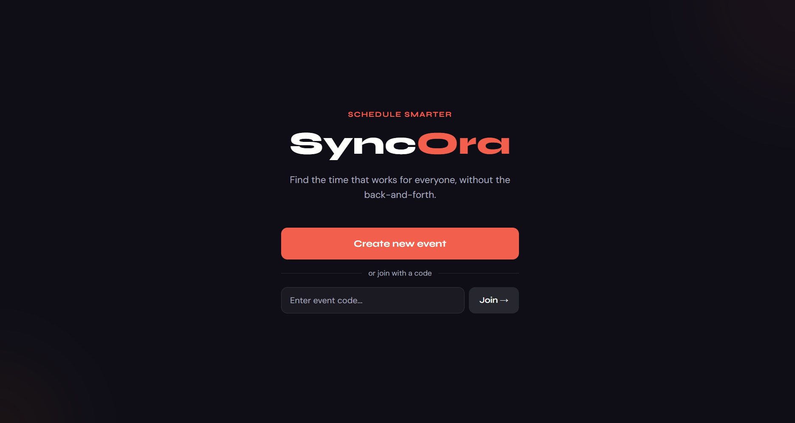
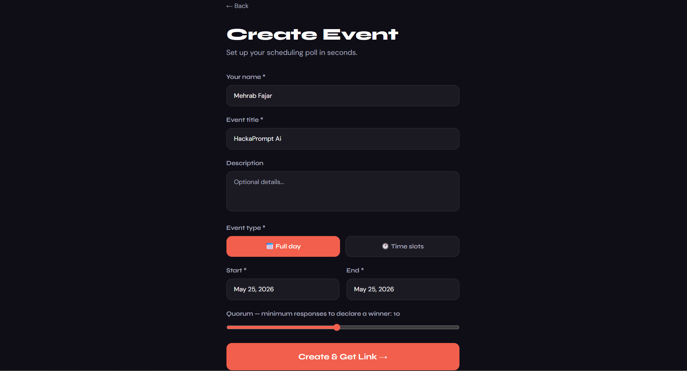
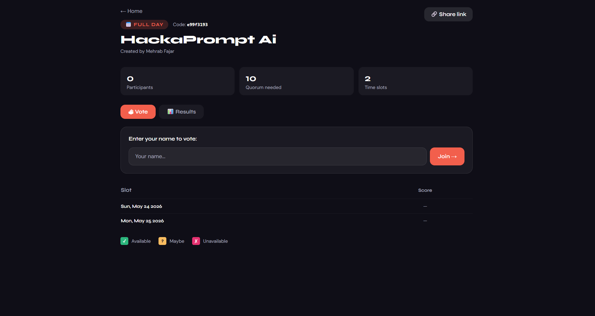
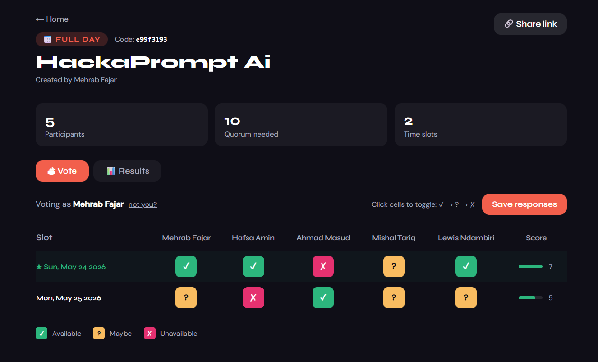
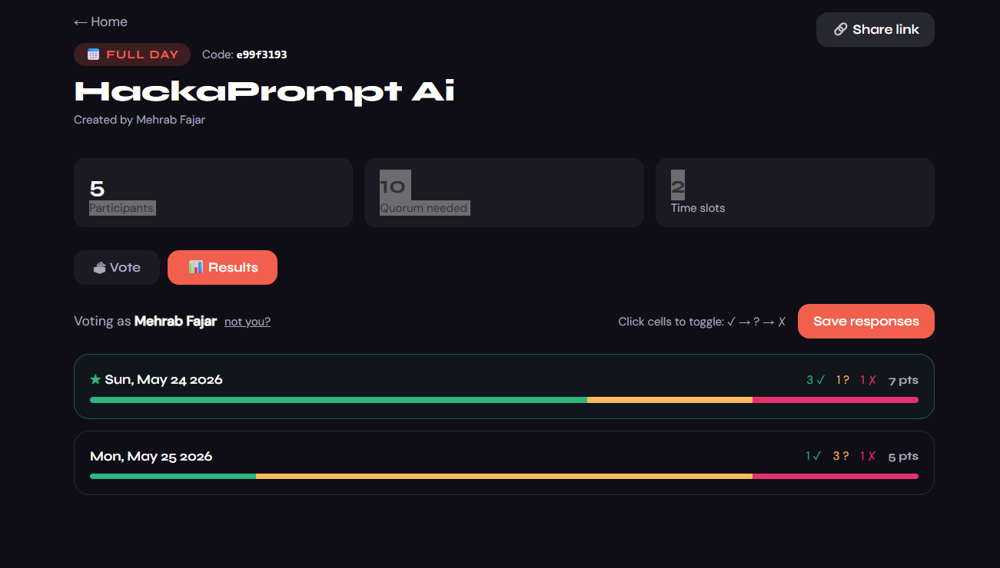

# SyncOra 🗓️


## Summary
SyncOra lets a group of people find a time that works for everyone, without the endless back-and-forth. You create an event, share a short code, and participants vote on their availability. The app scores each slot automatically and highlights the best option once enough people have responded.

No accounts. No emails required. Just a link.

---

## Features

- Create events as full-day polls or hourly time slots
- Auto-generates all slots from a date range — no manual entry
- Participants vote directly from a shareable link, no login needed
- Live response grid showing everyone's availability at a glance
- Weighted scoring: available = 2pts, maybe = 1pt, unavailable = 0
- Automatic best-slot detection and quorum notification
- Participants can edit their responses at any time
- Results tab with visual breakdown per slot

---

## Screenshots


<br>
<p align="center">
  
  
</p>
<br>
<p align="center">
  
  
</p>

---

## Tech Stack

| Layer      | Technology                        |
|------------|-----------------------------------|
| Backend    | Python 3.11 · Flask · SQLAlchemy  |
| Database   | SQLite (local) · PostgreSQL (prod)|
| Frontend   | React 18 · Vite · Tailwind CSS    |

---

## Project Structure

```
syncora/
├── backend/
│   ├── app/
│   │   ├── models/       # Event, Slot, Participant, Response
│   │   ├── routes/       # events, slots, responses
│   │   └── utils/        # slot generation, scoring, quorum logic
│   ├── config.py
│   ├── run.py
│   └── requirements.txt
├── frontend/
│   ├── src/
│   │   ├── api/          # Axios client
│   │   └── pages/        # Home, CreateEvent, EventView
│   ├── index.html
│   └── package.json
├── render.yaml
├── LICENSE
└── README.md
```

---

## Running Locally

### Prerequisites

- [Python 3.9+](https://www.python.org/downloads/)
- [Node.js 18+](https://nodejs.org/)

### macOS / Linux

```bash
git clone https://github.com/YOUR_USERNAME/syncora.git
cd syncora

# Backend
cd backend
python3 -m venv venv
venv/bin/pip install -r requirements.txt
venv/bin/python run.py &
cd ..

# Frontend (in a new terminal)
cd frontend
npm install
npm run dev
```

### Windows

```bash
git clone https://github.com/YOUR_USERNAME/syncora.git
cd syncora

# Backend
cd backend
python -m venv venv
venv\Scripts\activate
pip install -r requirements.txt
python run.py

# Frontend (in a new terminal)
cd frontend
npm install
npm run dev
```

Then open [http://localhost:5173](http://localhost:5173).

> Everything installs inside the project folder only — no system-wide changes. To uninstall, just delete the folder.

---

## API

| Method | Endpoint                  | Description                         |
|--------|---------------------------|-------------------------------------|
| POST   | `/api/events/`            | Create a new event                  |
| GET    | `/api/events/:id`         | Get event details and all slots     |
| POST   | `/api/events/:id/join`    | Join an event as a participant      |
| GET    | `/api/events/:id/result`  | Get ranked results and best slot    |
| POST   | `/api/responses/bulk`     | Submit or update multiple responses |

---

## Future Work

- **Public deployment** — the app currently runs locally. A hosted version is planned, with candidates including Render, Railway, or a self-managed VPS. A `render.yaml` configuration is already included in the repo for when this is set up.
- **Email invites** — let the event creator send invite links directly to participants
- **Timezone support** — automatically adjust slot times based on each participant's timezone
- **Custom slot durations** — allow 30-minute or 2-hour slots instead of fixed 1-hour blocks
- **Event expiry** — automatically close voting after a set date
- **Calendar export** — export the winning slot as an `.ics` file

---
## Context

SyncOra was built during HackaPrompt AI 2026, held on April 23, 2026 at Polo Fabio Ferrari, Povo, Trento, Italy - a challenge organised by the University of Trento exploring AI-assisted software development.
The goal was to design and deliver a functional web application from scratch using large language models, while reflecting honestly on what AI handles well and where human judgment remains irreplaceable.

Final Notes:
- AI significantly accelerated development, enabling the backend, frontend, database layer, and business logic to come together much faster than usual.
- Clear, specific instructions were important for getting consistent and usable outputs.
- Human oversight remained essential throughout, for catching subtle issues, making UX and product decisions, and ensuring the project stayed coherent end-to-end.

---
## Author

**Mehrab Fajar**  

- 🌐 Portfolio: https://mehrabfajar.github.io  
- 💻 GitHub Repository: https://github.com/mehrabfajar/SyncOra/


## License

MIT LICENSE - For educational Purpose 
